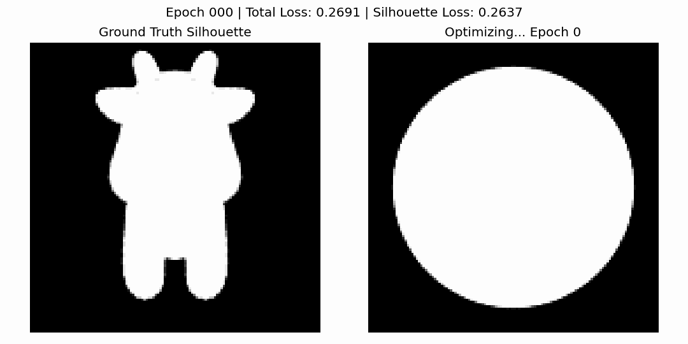

# 计算机图形学课程实验六：可微光栅化与网格优化

项目简介：本项目基于 Python、PyTorch 和 PyTorch3D 实现，完成了一个基于可微渲染的三维网格优化实验。

实验的核心目标是将一个初始球体网格通过梯度下降逐渐优化为目标奶牛模型的轮廓形状。程序首先对目标奶牛模型进行多视角剪影渲染，然后以球体作为初始网格，通过可微光栅化得到预测剪影，并将预测剪影与目标剪影之间的误差作为优化目标，反向传播更新网格顶点位置。为了防止网格在优化过程中出现拓扑崩坏，还加入了拉普拉斯平滑、边长约束和法向一致性等正则化项。

运行方式：

```bash
python main.py
```
---

## 一、项目架构

本实验代码位于 `src/Work06/` 目录下，目录结构如下：

```text
Work06/
├── main.py          # 实验六主程序，包含可微渲染、剪影优化和模型保存逻辑
├── README.md        # 实验六说明文档
└── assets/
    └── demo.gif     # 实验六运行效果演示 GIF
```

在整个仓库中的位置如下：

```text
CG-Lab/
├── src/
│   ├── Work01/
│   ├── Work02/
│   ├── Work03/
│   ├── Work04/
│   ├── Work05/
│   └── Work06/
│       ├── main.py
│       ├── README.md
│       └── assets/
│           └── demo.gif
├── main.py
├── README.md
├── pyproject.toml
├── uv.lock
├── .python-version
└── .gitignore
```

其中，本次实验六的核心代码文件是：

```text
src/Work06/main.py
```

由于本实验依赖 PyTorch3D 和 GPU 加速，实际运行建议在 ModelScope GPU Notebook 环境中完成。运行前需要将课程提供的 `cow.obj` 上传到 `main.py` 同一目录下。

---

## 二、代码逻辑

1. 初始化阶段

（1）程序首先检测当前运行设备，如果存在 CUDA GPU，则使用 GPU 运行，否则使用 CPU 运行。

（2）读取课程提供的 `cow.obj` 文件，作为目标奶牛网格模型。

（3）对目标网格进行中心化和归一化处理，使模型位于适合渲染和优化的坐标范围内。

（4）构建多个观察相机，从不同角度观察目标模型。

（5）创建 Soft Silhouette Renderer，用于进行可微剪影渲染。

2. 目标剪影生成

（1）程序从多个视角渲染目标奶牛模型。

（2）渲染结果取 alpha 通道，得到目标模型的黑白剪影图像。

（3）这些多视角剪影作为后续优化的监督信号。

3. 初始网格构造

（1）程序使用 `ico_sphere` 创建一个球体网格作为初始模型。

（2）定义 `deform_verts` 作为可学习变量，用于表示每个顶点的偏移量。

（3）每次迭代时，通过 `src_mesh.offset_verts(deform_verts)` 生成当前优化后的网格。

4. 可微渲染与损失计算

（1）将当前网格从相同的多个视角进行剪影渲染。

（2）计算预测剪影与目标剪影之间的均方误差，作为主要的剪影损失。

（3）加入拉普拉斯平滑损失，减少网格表面的不规则抖动。

（4）加入边长损失，避免边过度拉伸或压缩。

（5）加入法向一致性损失，使相邻三角面的法向量更加平滑。

（6）最终总损失由剪影损失和三个正则化项共同组成：

```text
总损失 = 剪影误差 + 拉普拉斯平滑 + 边长约束 + 法向一致性
```

5. 反向传播与结果保存

（1）每次迭代中，程序对总损失执行反向传播。

（2）优化器根据梯度更新 `deform_verts`，从而改变网格顶点位置。

（3）每隔一定轮数保存当前网格为 `.obj` 文件。

（4）同时保存目标剪影与当前预测剪影的对比图。

（5）优化结束后，程序会保存最终网格 `final_mesh.obj`，并将中间对比图合成为 `optimization.gif`。

---

## 三、实现功能

（1）读取并归一化目标奶牛网格模型。

（2）构建多视角相机，用于从不同方向渲染目标模型。

（3）实现基于 Soft Silhouette Shader 的可微剪影渲染。

（4）使用球体网格作为初始形状。

（5）通过梯度下降优化网格顶点偏移量。

（6）实现多视角剪影误差优化。

（7）加入拉普拉斯平滑正则化，防止表面剧烈抖动。

（8）加入边长约束，防止网格边过度拉伸。

（9）加入法向一致性约束，提高网格表面平滑性。

（10）保存中间优化模型、最终模型和优化过程 GIF。

| 文件 | 作用 |
| --- | --- |
| `cow.obj` | 课程提供的目标奶牛模型 |
| `mesh_epoch_*.obj` | 优化过程中的中间网格模型 |
| `final_mesh.obj` | 优化完成后的最终网格模型 |
| `optimization.gif` | 优化过程可视化 GIF |
| `assets/demo.gif` | 提交到仓库中的实验效果演示 |

---

## 四、效果演示

实验六运行效果如下：

