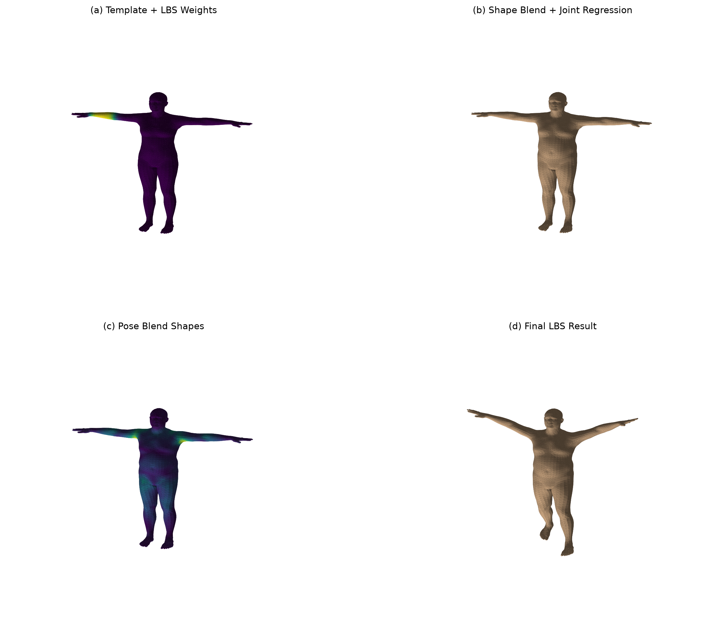
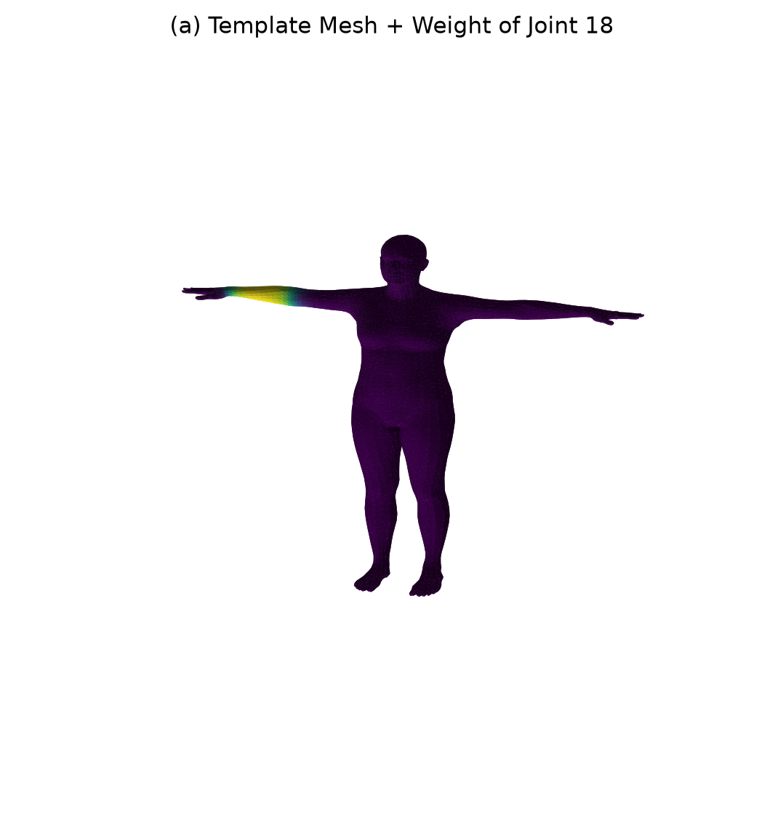
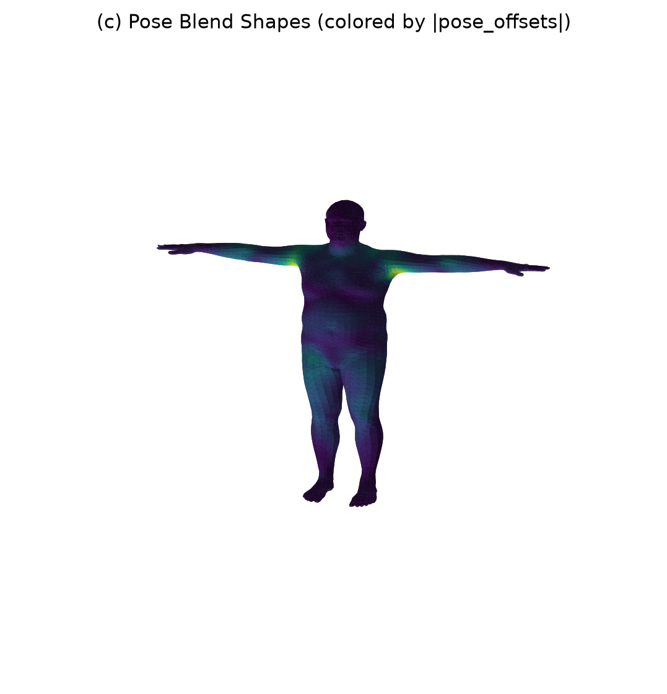
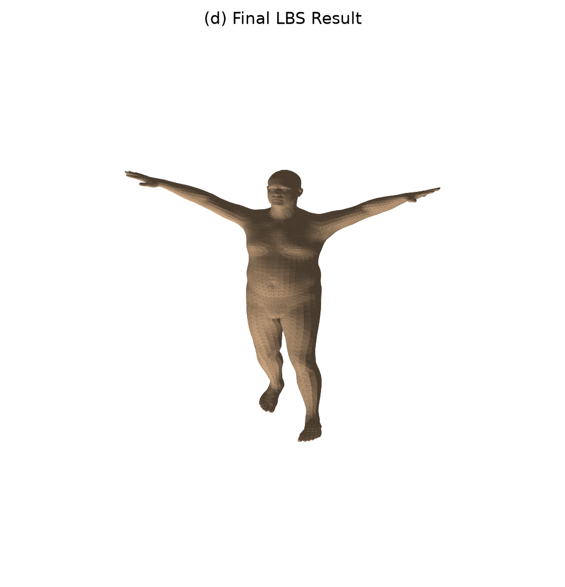

# 计算机图形学课程实验八：SMPL 模型与 LBS 蒙皮过程可视化

| 姓名 | 吕佳忆 |
| 学号 | 202411081068 |
| 专业 | 人工智能 |

项目简介：本项目基于 Python、PyTorch、SMPL 和 smplx 库实现，完成了 SMPL 参数化人体模型中 LBS（Linear Blend Skinning，线性混合蒙皮）过程的分阶段可视化。

程序读取 `SMPL_NEUTRAL.pkl` 模型文件，提取模板网格、形状参数、姿态参数、关节回归器和蒙皮权重等核心数据，并手动复现 LBS 的主要计算流程。实验将 LBS 分为模板网格与权重、形状校正与关节回归、姿态校正、最终蒙皮结果四个阶段，并分别保存可视化图片，便于理解 SMPL 模型从模板人体到最终姿态人体的变形过程。

运行方式：

```bash
uv run python src/Work08/main.py --model-dir ./models --out-dir ./outputs --joint-id 18
```

运行前需要将 SMPL 模型文件放到：

```text
src/Work08/models/smpl/SMPL_NEUTRAL.pkl
```

---

## 一、项目架构

本实验代码位于 `src/Work08/` 目录下，目录结构如下：

```text
Work08/
├── __init__.py
├── main.py                    # 实验八主程序，包含 SMPL 加载、LBS 计算和可视化保存逻辑
├── README.md                  # 实验八说明文档
├── models/
│   └── smpl/
│       └── SMPL_NEUTRAL.pkl   # SMPL 模型文件
├── outputs/                   # 程序运行生成的原始输出结果
└── assets/
    ├── comparison_grid.png    # 四阶段对比图
    ├── stage_a_template_weights.png
    ├── stage_b_shaped_joints.png
    ├── stage_c_pose_offsets.png
    ├── stage_d_lbs_result.png
    └── summary.txt
```

在整个仓库中的位置如下：

```text
CG-Lab/
├── src/
│   ├── Work01/
│   ├── Work02/
│   ├── Work03/
│   ├── Work04/
│   ├── Work05/
│   ├── Work06/
│   ├── Work07/
│   └── Work08/
│       ├── __init__.py
│       ├── main.py
│       ├── README.md
│       ├── models/
│       ├── outputs/
│       └── assets/
├── main.py
├── README.md
├── pyproject.toml
├── uv.lock
├── .python-version
└── .gitignore
```

其中，本次实验八的核心代码文件是：

```text
src/Work08/main.py
```

---

## 二、代码逻辑

1. 模型加载阶段

（1）程序首先读取 `models/smpl/SMPL_NEUTRAL.pkl` 模型文件。

（2）通过 `smplx.create()` 创建 SMPL 模型对象。

（3）从模型中获取模板网格 `v_template`、形状基 `shapedirs`、姿态基 `posedirs`、关节回归器 `J_regressor`、蒙皮权重 `lbs_weights` 和面片索引 `faces`。

2. 形状校正阶段

（1）程序构造一组示例 shape 参数 `betas`。

（2）通过形状基 `shapedirs` 和 shape 参数计算形状偏移。

（3）将形状偏移加到模板网格上，得到形状校正后的网格 `v_shaped`。

（4）使用关节回归器 `J_regressor` 从 `v_shaped` 中回归出人体关节位置。

3. 姿态校正阶段

（1）程序构造一组示例 pose 参数，包括全局朝向和身体关节姿态。

（2）使用 Rodrigues 公式将轴角形式的 pose 参数转换为旋转矩阵。

（3）根据关节旋转矩阵与单位矩阵之间的差异构造 pose feature。

（4）使用姿态基 `posedirs` 计算姿态相关偏移 `pose_offsets`。

（5）将姿态偏移加到形状校正网格上，得到姿态校正后的网格 `v_posed`。

4. LBS 蒙皮阶段

（1）根据 SMPL 的关节层级结构计算每个关节的刚体变换矩阵。

（2）根据每个顶点的蒙皮权重 `lbs_weights`，对多个关节变换进行加权混合。

（3）将混合变换作用到姿态校正后的顶点上，得到最终姿态下的人体网格 `verts`。

（4）程序将手动计算得到的 LBS 结果与 smplx 官方 forward 输出进行数值对比，计算平均绝对误差和最大绝对误差。

5. 可视化阶段

（1）保存模板网格与指定关节权重热力图。

（2）保存形状校正后的人体网格与关节点位置。

（3）保存姿态校正阶段的姿态偏移热力图。

（4）保存最终 LBS 蒙皮结果。

（5）保存四个阶段的总对比图 `comparison_grid.png`。

（6）记录模型顶点数、面片数、关节数和误差信息。

---

## 三、实现功能

（1）加载 SMPL 参数化人体模型。

（2）读取模板网格、面片、形状基、姿态基、关节回归器和蒙皮权重。

（3）实现 shape blend shapes，得到形状校正后的人体网格。

（4）实现 joint regression，从人体网格回归关节点。

（5）实现 pose blend shapes，得到姿态相关的局部校正。

（6）实现关节层级刚体变换。

（7）实现 Linear Blend Skinning，得到最终姿态人体。

（8）可视化指定关节的蒙皮权重热力图。

（9）可视化所有关节主导区域。

（10）保存 LBS 四阶段对比图。

（11）将手写 LBS 结果与官方 forward 结果进行误差对比。

| 输出文件 | 作用 |
| --- | --- |
| `stage_a_template_weights.png` | 展示模板网格与指定关节的蒙皮权重 |
| `all_joint_weights.png` | 展示人体表面由哪些关节主导控制 |
| `stage_b_shaped_joints.png` | 展示形状校正后网格和关节点 |
| `stage_c_pose_offsets.png` | 展示姿态校正偏移的空间分布 |
| `stage_d_lbs_result.png` | 展示最终 LBS 姿态结果 |
| `comparison_grid.png` | 展示 LBS 四个阶段的总对比 |
| `summary.txt` | 记录模型基础信息和误差结果 |

---

## 四、效果演示

实验八四阶段对比效果如下：



阶段一：模板网格与指定关节权重：



阶段二：形状校正后网格与关节点：


阶段三：姿态校正偏移：



阶段四：最终 LBS 蒙皮结果：


